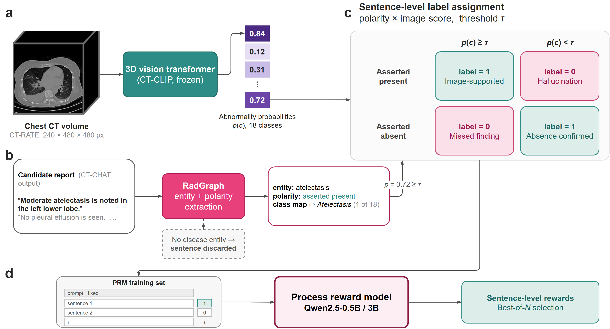
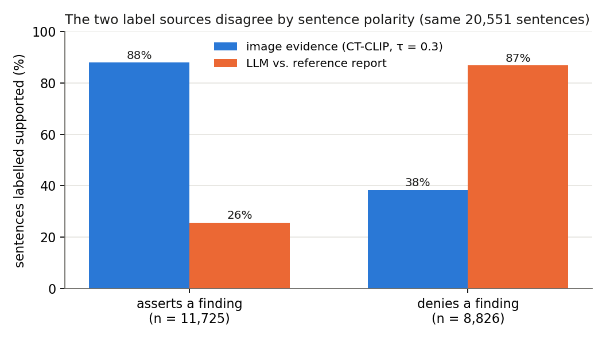

# CT-Sentence-Verify: a sentence-level labelled corpus for volumetric CT report verification

**Anonymous release accompanying a submission under review.** Author details will be added after the review period.

This repository releases the first sentence-level labelled corpus for volumetric (3D) chest-CT report generation, together with the pipeline that produced it. Every sentence was generated by CT-CHAT for one of 5,000 CT-RATE training studies and labelled twice, by two independent sources:

| Label source | Sentences | Studies | Supported | What "supported" means |
|---|---|---|---|---|
| **Image evidence** (CT-CLIP, τ = 0.3) | 20,551 | 4,955 | 66.6 % | the sentence's asserted polarity agrees with the thresholded CT-CLIP probability for the finding it names |
| Image evidence (CT-CLIP, τ = 0.4) | 20,551 | 4,955 | 64.7 % | same rule at the threshold used for the 3B reward model |
| **LLM vs. reference report** | 81,452 | 5,000 | 70.2 % | an LLM finds no concrete contradiction between the sentence and the radiologist's reference report |

The two label sets cover the **same 5,000 studies**, so a reward model trained on either can be compared under identical data. The image-evidence set is smaller because only sentences that name one of the 18 CT-RATE abnormality classes can be checked against the image; the LLM set keeps every sentence.



*(a) The frozen CT-CLIP encoder gives zero-shot probabilities for the 18 abnormality classes. (b) RadGraph parses each generated sentence into entities and their asserted polarity; entities are mapped to the 18 classes, and sentences without a disease entity are discarded. (c) Polarity and the class probability are combined at threshold τ into a binary support label. (d) One record per report trains a sentence-level reward model.*

## The corpus at a glance


Lung nodule, cardiomegaly and pleural effusion account for 63 % of the image-evidence set; lymphadenopathy (10 sentences) and lung opacity (79) are the rarest classes. The support rate also varies by class, from 40 % for pleural-effusion sentences to 98 % for atelectasis.



The two label sources are not interchangeable. On the same 20,551 sentences the image-evidence rule supports 88 % of sentences that *assert* a finding and 38 % of those that *deny* one, while the LLM-vs-reference rule does almost the reverse (26 % and 87 %). Overall agreement is 39.8 %. The reason is structural: reference reports rarely mention every normal structure, so a denial is almost never contradicted by the reference, whereas CT-CLIP scores an absence directly against the image. Reward models trained on the two sets therefore learn opposite preferences about how much a report should assert.

## What is (and is not) in this repository

Included:

- `data/sentences.parquet` — one row per generated sentence (81,452 rows) with study and volume identifiers, sentence text, RadGraph entities, the mapped abnormality class and polarity, the CT-CLIP probability for that class, and the three label columns.
- `data/ctclip_probs.parquet` — the 5,000 × 18 zero-shot CT-CLIP probability matrix, so labels can be re-derived at any threshold.
- `data/class_dictionary.json` — the fixed observation-to-class dictionary and anatomy rules.
- `data/study_manifest.csv` — the 5,000 studies (one study per patient, one reconstruction per study, train split only).
- `data/prm_format/*.jsonl` — the three label sets in TRL `PRMTrainer` format (`prompt`, `completions`, `labels`).
- `pipeline/` — the nine scripts that produced everything above, in order.
- `figures/` — the pipeline diagram and the two summary figures above.
- `scripts/verify_release.py` — recomputes the counts in the table and checks that the released labels can be rebuilt from the released inputs.

Not included, because they are governed by their own licences:

- **CT volumes and reference reports.** These belong to CT-RATE. Request access at <https://huggingface.co/datasets/ibrahimhamamci/CT-RATE> (gated, CC BY-NC-SA 4.0). `volume_id` in every file is the CT-RATE volume name without `.nii.gz`, e.g. `train_19284_a_1`.
- **CT-CHAT and CT-CLIP weights.** Available from the same authors' releases; see <https://github.com/ibrahimethemhamamci/CT-CHAT> and <https://github.com/ibrahimethemhamamci/CT-CLIP>.
- **Trained reward-model checkpoints.** Not part of this release.

No patient-identifying information is present: CT-RATE identifiers are already pseudonymous, and no DICOM metadata columns are carried over.

## Schema of `data/sentences.parquet`

| Column | Type | Description |
|---|---|---|
| `study_id` | str | CT-RATE study, e.g. `train_19284_a` |
| `volume_id` | str | CT-RATE volume used for generation and for CT-CLIP, e.g. `train_19284_a_1` |
| `sentence_index` | int | position of the sentence in the generated report |
| `sentence` | str | the generated sentence |
| `radgraph_entities` | str (JSON) | RadGraph entities `[{tokens, label}]`; `null` if RadGraph returned none |
| `radgraph_class` | str / null | one of the 18 CT-RATE classes mapped from the entities; `null` if no class could be mapped |
| `polarity` | `present` / `absent` / null | whether the sentence asserts or denies that class |
| `p_class` | float / null | CT-CLIP zero-shot probability of `radgraph_class` for this volume |
| `label_tau030` | bool / null | image-evidence label at τ = 0.3 |
| `label_tau040` | bool / null | image-evidence label at τ = 0.4 |
| `label_llm` | bool / null | LLM-vs-reference label |

## The image-evidence labelling rule

For a sentence with mapped class *c* and asserted polarity *a*,

    y = 1[ a = present  ⇔  p(c) ≥ τ ]

An asserted finding is *supported* when the image probability is at least τ; a denied finding is *supported* when it is below τ. The threshold was chosen on a separate selection pool by the downstream Best-of-N metric: τ = 0.3 for the 0.5B reward model and τ = 0.4 for the 3B one. This rule lets a correct negative statement receive positive supervision even when the reference report is silent about that finding, which a reference-text rule cannot do.

Class mapping: RadGraph marks each observation as definitely present (`OBS-DP`), definitely absent (`OBS-DA`) or uncertain; uncertain observations are ignored. The observation token is looked up in `class_dictionary.json`. Three site-ambiguous terms (calcification, effusion, thickening) require the relevant anatomy in the same sentence; `"heart contour is normal"`-type sentences map to a denial of cardiomegaly. Sentences with no mapped class have `radgraph_class = null` and are excluded from the image-evidence set (81,452 → 20,551).

## The LLM labelling rule

One request per study sends the reference report and all of the study's generated sentences to `meta-llama/llama-3.1-70b-instruct` (temperature 0) with an asymmetric instruction: silence in the reference is not an error; only a concrete abnormality that the reference contradicts or does not contain is. The full prompt is in `pipeline/07_llm_labels.py`. A study is kept only if at least 80 % of its sentences received a label; all 5,000 studies passed.

## Reproducing the pipeline

```
pip install -r requirements.txt
export CTSV_ROOT=$(pwd)          # optional; defaults to the repository root

python pipeline/01_build_manifest.py   --metadata <ct-rate>/train_metadata.csv --reports <ct-rate>/train_reports.csv
python pipeline/02_generate_reports.py <shard> <n> --ctchat ... --weights ... --base ... --encodings ...
python pipeline/03_ctclip_probs.py     --ctclip ... --ckpt CT-CLIP_v2.pt --volumes ... --reports ... --labels ...
python pipeline/04_split_sentences.py
python pipeline/05_radgraph_parse.py   <shard> <n>
python pipeline/06_ctclip_labels.py    --taus 0.3,0.4
OPENROUTER_API_KEY=... python pipeline/07_llm_labels.py --reports <ct-rate>/train_reports.csv
python pipeline/08_build_prm_dataset.py --label label_tau030 --out data/prm_format/ctclip_tau030.jsonl --hf-dir work/hf_tau030
python pipeline/09_train_prm.py        --base Qwen/Qwen2.5-0.5B --dataset work/hf_tau030 --out work/prm_0.5b
```

Steps 2, 3 and 5 need a GPU; steps 2 and 3 additionally need the CT-CHAT / CT-CLIP code and weights; step 7 needs the CT-RATE reference reports and an API key. Steps 4, 6 and 8 run on CPU from the released files. Stochastic generation in step 2 is seeded but depends on the hardware and library versions, so a rerun gives a corpus of the same construction rather than these exact sentences; the released `data/` is therefore the artefact of record. Everything from step 6 onwards is deterministic given `data/`.

To check the release itself:

```
python scripts/verify_release.py
```

## Licence

- Data (`data/`): [CC BY-NC-SA 4.0](https://creativecommons.org/licenses/by-nc-sa/4.0/), inherited from CT-RATE (`LICENSE-DATA`).
- Code (`pipeline/`, `scripts/`): MIT (`LICENSE-CODE`).

## Citation

A citation will be added after the review period.
